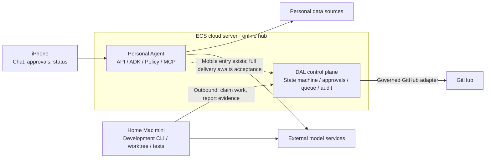

# Personal Agent

**Language / 语言:** [English](./README.en.md) · [简体中文](./README.md)

> Local open-source release candidate; not yet finalized or published. See the [verification notes](./docs/verification.en.md) for disclosure boundaries and unfinished checks.

> This version comes from a fixed private development baseline as of 2026-09-23. Historical evidence from the live environment is recorded separately from verification of this open-source release candidate. The complete mobile-to-delivery development workflow has not been accepted in this round. See the [verification notes](./docs/verification.en.md).

**A personal agent built by a product manager with vibe coding: connecting personal data, performing governed actions, and exploring an auditable development loop.**

`Single-user` · `ECS + Mac mini` · `Governed MCP` · `Human-in-the-loop`

> [!IMPORTANT]
> **This repository shares code and architecture, but is not directly deployable.** It does not include the author's personal data, credentials, production configuration, or complete runtime environment. It is not a ready-to-use app or service release.

## Why I started this project

I wanted an agent I could use over time, not just a chat interface. The phone is the entry point, an ECS server is the online hub, personal data is accessed through governed tools, and development capabilities are gradually delegated to an automated process with approval and verification boundaries.

**The project began in July 2026; the first commit in the original repository was on July 23, before Muse was publicly announced on September 8, 2026.** This is not a copy, port, or open-source implementation of Muse. The overlap is in the direction of building an agent that serves a person over time. My starting point was my own data and needs; Muse is positioned publicly as a personal agent for a broad audience.

[Project origins, timeline evidence, and comparison with Muse →](./docs/overview/origin-and-muse.md) (Chinese)

The release history preserves the real order and original dates of commits from private development. To protect personal data and deployment details, commit contents and identifiers were rewritten; some commits became empty after private material was removed. [History preservation and redaction →](./docs/overview/history-and-privacy.md) (Chinese)

## About vibe coding

I'm [Henson](https://zhuyawei.com/), a product manager. I built this project primarily with AI coding tools: I own the requirements, product and architecture decisions, reviews, and acceptance; AI generates the code, which is then iterated on.

**I cannot yet fully control the verbosity, repeated abstractions, or local complexity of the code.** My engineering experience does not let me review every line as a professional engineering team would. This is not a showcase of concise code or best practices. I am sharing the product thinking, architecture choices, and development method that emerged from a real project. Specific bug reports and simplification suggestions are welcome.

[Development approach, capability boundaries, and verification →](./docs/overview/engineering.md) (Chinese)

## Core architecture

The project has two related but independent paths:

| Path | Purpose |
| --- | --- |
| **Personal Agent** | iOS interaction → Agent runtime on ECS → policy checks and MCP tools → personal data sources and actions |
| **DAL · Development Agent Loop** | Request → PRD approval → technical design → implementation → verification and independent review → delivery acceptance |

**The model proposes actions, the system governs state and permissions, and the person decides the scope and accepts the result.** The everyday agent can run without DAL. DAL's complete automated workflow is still being built, and delivery does not automatically mean merge or deployment.

**ECS decides whether the next step is allowed; the Mac mini executes approved steps.** The Worker connects outbound to ECS, so it does not need a public inbound connection to the home network. A MacBook is used for manual development and exception handling, not as another global orchestrator. The diagram shows responsibilities; it does not imply that every path has been accepted end to end.

The main stack is Swift/iOS, Python/FastAPI, Google ADK, MCP, SQLite/SQLAlchemy, governed development CLIs, and Git worktrees.

[Architecture and deployment →](./docs/overview/architecture.md) · [Development workflow →](./docs/overview/development-workflow.md) · [State and authorization →](./docs/overview/state-and-authorization.md) (detailed guides in Chinese)

## Current status

The table separates what is in this source snapshot from historical runtime evidence. Later private fixes outside the fixed snapshot do not count as part of this release candidate.

| Area | Status |
| --- | --- |
| Everyday chat, Finance, sessions, and context management | Implemented in the original single-user environment, with usage and acceptance records |
| ECS DAL control plane and Mac mini Worker | Deployed; a single-role `report_only` execution with synthetic input has live evidence |
| Mobile request through planning, review, staged execution, and delivery | Mobile authorization, automated workflow, and commit review exist; **complete delivery awaits acceptance** |
| Calendar and other personal capabilities | Calendar has an implementation and isolated acceptance records, but its full real-world workflow remains unverified. A complete Memory module does not yet exist and is the highest development priority for the next phase; knowledge-base work follows the later roadmap |

[Full capability table and verification boundaries →](./docs/overview/capabilities.md) (Chinese)

## What comes next

| Order | Focus |
| --- | --- |
| **Highest priority** | Build a manageable Memory module: define memory sources and types; support cross-session retrieval, correction, expiration, and deletion; and govern how sensitive information enters context |
| **Next** | Complete one real development request from mobile intake through PRD approval, design, implementation, verification, independent review, and delivery acceptance |
| **Later** | Add staged execution and failure recovery; complete Calendar's real-world workflow; expand knowledge-base and other personal capabilities; then bring usage feedback into the governed development process |

[Detailed roadmap and acceptance criteria →](./docs/overview/roadmap.md) (Chinese)

## Related posts

The repository docs explain how the system works. My [blog](https://zhuyawei.com/blog/) covers why I built it and the trade-offs along the way. The open-source announcement is available in English; the other links below lead to Chinese posts.

| Topic | Post |
| --- | --- |
| Open-source announcement | [I Open-Sourced Personal Agent: What Is Included](https://zhuyawei.com/en/blog/personal-agent-open-source/) |
| Starting point | [Why I decided to go all in on a side project: Personal Agent](https://zhuyawei.com/blog/all-in-personal-agent/) |
| Phase-one retrospective | [Building phase one of Personal Agent with vibe coding](https://zhuyawei.com/blog/personal-agent-phase-one/) |
| Architecture choices | [After generic harnesses became open source: what must Personal Agent still own?](https://zhuyawei.com/blog/harness-governance-scar-tissue/) |
| Longer-term direction | [Coding agents may just be suppliers to Personal Agent](https://zhuyawei.com/blog/personal-agent-as-my-os/) |

## Further reading

Details on state machines, authorization, leases, recovery protocols, model configuration, and the Muse comparison are in the [documentation index](./docs/overview/README.md) (Chinese). You do not need to read every design document to understand the project.

To explore the code, start with the [code guide](./docs/overview/code-guide.md). For exceptional cases and privacy boundaries, see [recovery and security](./docs/overview/recovery-and-security.md). Both guides are currently in Chinese.

## Contributing and license

Feedback on product design, architecture choices, reproducible defects, and code simplification is welcome. Discuss requirements and design before changing features or permissions. Do not submit real personal data, credentials, or production logs. See [Contributing](./CONTRIBUTING.md) and [Security](./SECURITY.md).

The project uses the [MIT License](./LICENSE). Third-party dependencies retain their own licenses.

---

Documentation prepared on 2026-09-22. Sharing the implementation and design experience does not imply production readiness or full reproducibility.
