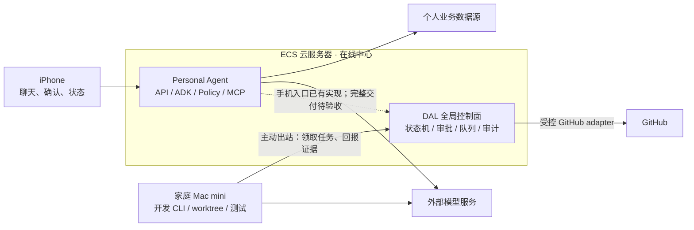

# Personal Agent

**语言 / Language：** [简体中文](./README.md) · [English](./README.en.md)

> 本地开源准备候选，尚未定版或发布。数据公开边界与未完成验证见[验证说明](docs/verification.md)。

> 本版取自截至 2026-09-23 的固定私人开发基线。历史线上证据与本次公开快照验证分开记录，完整手机开发交付链路尚未在本轮验收。见[验证说明](docs/verification.md)。
**一个产品经理用 vibe coding 构建的个人 Agent：连接自己的数据，执行受控操作，并探索可审核的自动化开发闭环。**

`Single-user` · `ECS + Mac mini` · `Governed MCP` · `Human-in-the-loop`

> [!IMPORTANT]
> **本仓库仅公开项目代码与架构，不能直接部署。** 不提供作者的个人数据、凭据、生产配置或完整运行环境，也不是开箱即用的 App／服务发行版。

## 项目从哪里来

我想做的，是一套围绕自己长期使用的 Agent，而不只是一个聊天界面：手机是入口，ECS 是在线中心，个人数据通过受控工具接入，开发能力逐步交给有审批和验证边界的自动化流程。

**项目在 2026 年 7 月已启动，原仓库首个提交为 7 月 23 日，早于 Muse 于 2026 年 9 月 8 日公开发布。** 它不是 Muse 的复刻、移植或开源实现，而是个人项目与大厂应用在“长期服务个人的 Agent”方向上的不谋而合。我的起点是自己的数据与使用需求；Muse 的公开定位是面向广泛用户的个人 Agent 产品。

[项目起源、时间依据与 Muse 对照 →](./docs/overview/origin-and-muse.md)

公开仓库保留了私人开发阶段的真实 Git 提交顺序和原始时间。为保护个人数据与部署信息，历史内容及提交标识经过改写；部分提交因隐私内容移除而变空。[历史保留与脱敏说明 →](./docs/overview/history-and-privacy.md)

## 关于 vibe coding

我是 [Henson](https://zhuyawei.com/)，一名产品经理。这个项目主要借助 AI 编程工具完成：我负责需求、产品与架构取舍、组织评审和验收，代码由 AI 生成并持续迭代。

**代码的冗长性、重复抽象和局部实现复杂度，并不是我目前能够充分控制的部分。** 受限于工程经验，我无法像专业工程团队那样逐行把控所有实现。这不是简洁代码或最佳实践的示范；我希望分享的是产品思考、架构取舍，以及一个真实项目逐步形成的开发方法。欢迎指出具体缺陷和可以简化的地方。

[开发方式、能力边界与验证方法 →](./docs/overview/engineering.md)

## 核心框架

项目有两条相关但独立的链路：

| 链路 | 做什么 |
| --- | --- |
| **Personal Agent** | iOS 交互 → ECS 上的 Agent Runtime → 策略校验与 MCP 工具 → 个人业务数据和操作 |
| **DAL · Development Agent Loop** | 需求 → PRD 审批 → 技术设计 → 编码 → 验证与独立审查 → 交付验收 |

**模型提出行动，系统管理状态与权限，人决定范围和接受结果。** 日常 Agent 不依赖 DAL 才能运行；DAL 的完整自动化链路仍在建设中，交付也不自动等于合并或部署。

**ECS 决定下一步是否允许执行，Mac mini 完成已获准的步骤。** Worker 主动连接 ECS，不需开放家庭公网入口。MacBook 用于人工开发与异常接管，不是另一个全局编排器。上图表示职责分工，不表示所有路径均已验收。

主要技术栈：Swift／iOS、Python／FastAPI、Google ADK、MCP、SQLite／SQLAlchemy，以及受控的开发 CLI 和 Git worktree。

[架构与部署 →](./docs/overview/architecture.md) · [完整开发流程 →](./docs/overview/development-workflow.md) · [状态机与授权 →](./docs/overview/state-and-authorization.md)

## 当前进度

以下区分当前公开源码与历史运行证据；未纳入固定快照的后续私人修复不计入本版。

| 范围 | 状态 |
| --- | --- |
| 日常聊天、Finance、会话与上下文管理 | 原单用户环境已有实现和使用／验收记录 |
| ECS DAL 控制面与 Mac mini Worker | 已有部署；单角色、合成输入的 `report_only` 执行有实测证据 |
| 手机需求到规划、审查、阶段推进和交付 | 已有手机授权、自动工作流和提交审查实现；**完整交付待验收** |
| Calendar 与其他个人能力 | Calendar 有实现和隔离验收记录，真实完整链路仍待验证；Memory 尚未形成完整模块，现列为下一阶段最高开发优先级；知识库等按后续路线推进 |

[完整能力表与验证边界 →](./docs/overview/capabilities.md)

## 接下来做什么

| 顺序 | 重点 |
| --- | --- |
| **最高优先** | 搭建可管理的 Memory 模块：明确记忆来源与类型，支持跨会话检索、纠错、失效和删除，并控制敏感信息进入上下文的边界 |
| **随后** | 跑通一项真实开发需求：手机输入、PRD 审批、设计、编码、验证、独立审查与交付验收 |
| **后续** | 补齐分阶段推进与故障恢复；完成 Calendar 真实闭环，扩展知识库等个人能力，再让使用反馈进入受控开发流程 |

[详细路线图与验收条件 →](./docs/overview/roadmap.md)

## 相关博文

仓库文档说明系统如何工作；[博客](https://zhuyawei.com/blog/)记录我为什么这样做，以及一路上的取舍和复盘。

| 阅读角度 | 文章 |
| --- | --- |
| 项目起点 | [我为什么决定把业余时间 all in 到一个大项目：Personal Agent](https://zhuyawei.com/blog/all-in-personal-agent/) |
| 一期复盘 | [用 Vibe Coding 完成 Personal Agent 一期](https://zhuyawei.com/blog/personal-agent-phase-one/) |
| 架构取舍 | [通用 Harness 开源之后：Personal Agent 还必须自己负责什么？](https://zhuyawei.com/blog/harness-governance-scar-tissue/) |
| 长期方向 | [我突然发现，Coding Agent 可能只是 Personal Agent 的供应商](https://zhuyawei.com/blog/personal-agent-as-my-os/) |

## 深入阅读

完整的状态机、授权、租约、恢复协议、模型配置和 Muse 对比已拆入 **[文档目录](./docs/overview/README.md)**，无需先读完全部设计才能理解项目。

开始读代码：[代码导读](./docs/overview/code-guide.md)。关注异常与隐私：[故障恢复与安全边界](./docs/overview/recovery-and-security.md)。

## 参与与许可

欢迎围绕产品设计、架构取舍、可复现缺陷和代码简化提出反馈。新功能或权限变化先讨论需求与设计；请勿提交真实个人数据、凭据或生产日志。

本项目采用 [MIT License](./LICENSE)。第三方依赖保留各自许可。

---

文档整理：2026-09-22。公开的是项目实现与设计经验，不是生产可用性或完整复现的承诺。
