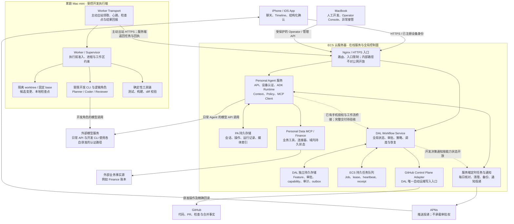
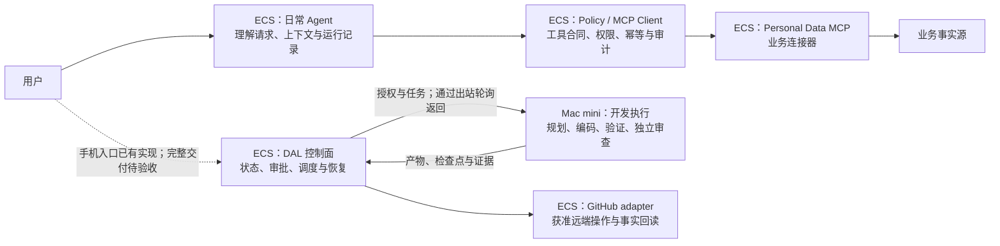

# 架构与部署

> 本版包含截至 2026-09-22 的已合入实现。历史线上证据与本次公开快照验证分开记录，完整手机开发交付链路尚未在本轮验收。见[验证说明](../verification.md)。
[项目首页](../../README.md) · [文档目录](./README.md)

ECS、Mac mini、iPhone 和人工操作端分别做什么，以及两条运行链路如何隔离。

> 实现清单更新于 2026-09-23。文中的 2026-09-17 部署与实测记录属于历史证据；本轮离线结果见验证说明。

本篇导航：[总体架构：ECS 在线中心与家庭执行节点](#architecture)

## 1. 总体架构：ECS 在线中心与家庭执行节点

### 1.1 先看实际部署，而不只看逻辑模块

**原系统的在线中心是 ECS 云服务器。** 它同时承载日常 Personal Agent 服务和 DAL 开发控制面；家中的 Mac mini 承担开发任务执行，iPhone 承担交互与结构化确认，MacBook 承担人工开发和运维接管。ECS 不是仅用于转发请求的网关，Mac mini 也不是整个系统的后端。

以下描述的是已审阅快照所对应的部署分工，不是公开版的安装要求，也不意味着每条产品路径均已完成验收。**实线表示已有组件之间的职责与通信关系；虚线表示扩展、部分桥接或尚未贯通的完整产品路径。连线不代表自动取得操作权限。**

图中的队列是 ECS 上的持久队列逻辑，不暗示另外部署了消息中间件。Mac mini 通过受控 HTTP 接口访问它，**不跨机器共享 ECS 的 SQLite 文件**。图也不表示 ECS 主动连接家庭内网：Worker 自己发起出站请求，任务经请求响应返回。

**部署事实与完成度要同时保留：** 2026-09-17 的记录支持 ECS 上 PA／Finance／DAL 服务、Mac mini Worker，以及一次受控合成输入的 `report_only` 双机执行；不支持把整张图描述为已验收的手机需求到自动交付产品。

部署决策见 ECS Orchestrator / Home Mac Worker ADR（原仓库路径：`docs/dal/ADR-ECS-orchestrator-home-mac-worker.md`）；服务与入口配置见 [deploy](../../deploy/)、[DAL Nginx 上游配置](../../deploy/nginx/dal-upstream.conf)。详细能力边界仍以[当前能力](./capabilities.md#status)为准。

### 1.2 再看两条逻辑链路

部署在同一台 ECS，不代表日常 Agent 与开发 Agent 共用一个不受限的循环。两条链路分别是：

在日常链路中，**Agent Runtime 位于 ECS，由 ECS 调用已配置的外部模型 API**，不是要求 iPhone 或 Mac mini 承担日常推理，也不表示模型权重部署在 ECS 上。

在 DAL 链路中，**ECS 决定下一步是否允许执行，Mac mini 完成被批准的当前步骤**。开发角色通过受限 CLI／适配器执行；其登录凭据遵守执行端的独立保管边界，不能因为 ECS 拥有调度权就把开发账户、Finance 凭据和生产部署权限混在一起。一个物理 Worker 可以承载多个逻辑角色，但不能因此共用不受限的上下文和权限。

日常 Agent 不依赖 DAL 才能运行；Calendar 则因平台权限与事实源使用 iPhone EventKit 执行和同步的设计，不能由“ECS 是在线中心”推导出所有业务写入都发生在 ECS。

依据：开发闭环技术方案（原仓库路径：`docs/开发Agent闭环技术方案_v1.0.md`）、完整开发流程规划（原仓库路径：`docs/dal/DAL_完整开发流程优先规划_v0.1.md`）、[日常运行时 Host](../../src/personal_agent/runtime/host.py)。

### 1.3 ECS 具体负责什么

| 职责 | ECS 承载的内容 | 不应误解为 |
| --- | --- | --- |
| 统一在线入口 | Nginx／HTTPS、PA API、获准的 Worker 与 Operator 入口；设备／调用方身份校验 | 对公网开放任意管理接口，或仅凭来自本机就信任请求 |
| 日常 Agent 运行 | Google ADK Runtime、模型 API 适配、Context Builder、工具清单、Policy 与调用记录 | 只转发手机请求，或把模型本身部署在 ECS 本地 |
| 业务工具服务 | Personal Data MCP、Finance 连接器、域内规则与外部事实源交互 | 让模型直接读取整台服务器、任意数据库或生产密钥 |
| 在线持久状态 | PA 的会话／操作记录，以及 DAL 独立的工作流、审批、授权、回执与审计 | 用手机缓存、模型对话或 Worker 本地文件替代服务端权威状态 |
| 开发流程控制 | 判断状态迁移、审批是否有效、任务能否派发、是否暂停／取消／核对／续批 | 在 ECS 上直接运行开发 CLI，或让 Worker 自行推进整个 Feature |
| 跨机器调度 | 持久队列、任务领取、租约、心跳和结果接纳 | 跨机器共享数据库文件，或重启后默认重放所有任务 |
| GitHub 自动操作 | DAL 的唯一自动远端写入适配器、外部副作用记录与精确回读 | Worker 持有 GitHub 写权限，或已有 adapter 就代表自动 PR／合并已贯通 |
| 定时运行与运维 | 每日核对、清理、备份和通知相关服务／定时器，以及受控发布与健康检查 | 手机必须常驻前台，或存在定时器就证明所有故障恢复均已验证 |

这些职责中既有生产日常链路，也有 DAL 已实现的合同和有限执行范围；每一项的产品完成度仍需对照能力地图，不能因为共处一台服务器就统一标记为“全部完成”。

### 1.4 同一台 ECS 内部，也要有信任边界

**ECS 是部署边界，不是一个所有进程共享权限的单体。** 原部署把 PA API、Personal Data MCP 和 DAL 作为有独立职责的服务处理，按服务拆分运行身份、数据库、密钥与配置。API 服务可以调用 MCP 工具，不等于它应直接持有 MCP 的业务凭据；DAL 也不能因同机部署就读取 Finance 的生产数据或拥有生产发布权限。

在已读取的入口配置中，PA 使用 Unix socket 接受代理访问，DAL 使用本机 loopback 上游。公网入口拒绝内部路径，PA 与 DAL 的内部通信仍需专用认证／签名；**loopback 是网络位置，不是身份凭据**。服务用户、目录权限、进程限制和请求级认证需要共同工作，不能只靠 Nginx 路由或“都在我的服务器上”。

公开说明保留 ECS、Mac mini、iPhone 和人工操作端的职责及通信方向；公网 IP、实际域名、SSH 身份、真实资源标识、凭据与备份内容不属于公开架构。**可迁移的设计不等于当前完全本地，也不意味着脱敏时应删除云端部署这一事实。**

原部署参考：服务身份与隔离（原仓库路径：`deploy/README.md`）、[DAL 入口配置](../../deploy/nginx/dal-upstream.conf)。这些文件若随公开版发布，须单独完成脱敏，不能因为 README 已脱敏就直接公开原配置。

### 1.5 跨机器通信与失联时的职责

| 情形 | 职责与处理边界 |
| --- | --- |
| 正常执行 | ECS 保存任务与有效授权；Mac mini 主动领取获准任务、上报心跳与检查点；ECS 校验结果绑定后接纳回执，满足相应合同才推进状态 |
| Mac mini 离线或重启 | 日常 PA／Finance 在架构上不依赖开发 Worker；开发任务是否可重新执行仍由 ECS 根据 lease、派发标记和外部副作用判断，不能把失联等价为“没执行” |
| ECS 暂时不可达 | Worker 不能变成备用全局编排器；已开始的执行按既有租约、执行限制和 Supervisor 协议处理，不凭本地缓存自行续权或推进工作流 |
| 两端重连 | 先核对任务所有权、epoch、授权、检查点和结果；有未明副作用时进入核对路径，而不是无条件重复模型调用或远端写入 |
| MacBook 人工接管 | 作为 Operator／人工开发端调用受保护入口；不是第三个 Orchestrator，人工 GitHub 操作也不能伪装成 DAL 自己获准完成的自动动作 |

这张表说明设计职责，不是对所有真实断网／重启场景均已通过故障注入测试的声明。**单 ECS 控制面也是当前可用性依赖**：持久化、备份和恢复协议不等于已有高可用集群或自动故障切换。真实恢复覆盖属于后续里程碑。

当前部署记录中的 Mac mini 由 launchd 定期运行 Worker poll；ADR 允许出站长轮询或等价的受控传输，不应把架构上的“常在线 Worker”写成当前已有常驻长连接。准确调度周期、超时与重试预算以发布版本配置为准。

### 1.6 谁保存哪一类事实

| 对象 | 权威位置 | 其他组件的角色 |
| --- | --- | --- |
| 已发生的业务记录 | 对应外部业务事实源，例如账本系统 | ECS 的 MCP／Agent 保存操作与证据，不用聊天回答替代账本事实 |
| 日历事件 | Calendar 设计中的 iPhone EventKit | 服务端镜像用于查询和同步，不凭镜像推断手机写入已经成功 |
| 会话、操作进度、任务运行记录 | ECS 上的 Personal Agent 持久存储 | iOS 展示、输入和确认 |
| DAL 工作流状态、有效审批、执行授权 | ECS 上的 DAL 控制面及独立数据库 | Mac mini、手机和 GitHub 文本不能自行改写权威状态 |
| Worker 工作区与进程事实 | Mac mini 当前工作区、Supervisor 与运行证据 | ECS 根据绑定后的证据接纳结果；本地“成功”不直接成为 Feature 完成 |
| 仓库内容、提交、PR、合并结果 | Git 与 GitHub 的实际对象 | ECS 控制面按精确目标回读，摄入外部事实 |
| 开发产物与审查结论 | 版本化产物及其绑定证据 | 模型解释作为输入，不独自充当验证结果 |

“一个逻辑权威”不是把所有信息塞入一张表，也不是声称业务事实都存在 ECS；它是保证每类事实有明确的判定者，缓存、投影和模型描述不能越权成为事实。

### 1.7 技术栈与模块

| 层次 | 当前选择与部署位置 | 对应位置 |
| --- | --- | --- |
| 移动客户端 | iPhone 上的原生 iOS / Swift | `ios/` |
| 云端服务与入口 | ECS、Nginx／HTTPS、systemd 服务与定时器 | `deploy/` |
| 服务端 API | ECS 上的 Python 3.12、FastAPI、Pydantic | `src/personal_agent/`、`src/personal_agent_dal/service/` |
| 日常 Agent Runtime | ECS 上的 Google ADK，配合外部模型适配与调用见证 | `src/personal_agent/runtime/` |
| 工具与业务合同 | ECS 上的 MCP、结构化 schema、策略校验及业务连接器 | `src/personal_agent/mcp_client/`、`src/personal_data_mcp/` |
| 持久化 | SQLite、SQLAlchemy、Alembic；在线服务与 Worker 保持各自状态边界 | 各模块 `storage/` 与 Worker 本地状态模块 |
| 开发工作流 | ECS 上的确定性状态机、冻结合同与控制器 | `src/personal_agent_dal/machine/` |
| 开发执行 | Mac mini 的 Worker、worktree、受控 CLI、Supervisor、确定性验证 | `src/personal_agent_dal/worker/` |
| 远端开发操作 | ECS 上的 GitHub adapter 与外部副作用管理 | `src/personal_agent_dal/github/` |
| 工程工具 | uv、锁定依赖、pytest、Swift 测试、CI gate | `pyproject.toml`、`uv.lock`、`tests/`、`.github/workflows/` |

准确依赖及版本以 [pyproject.toml](../../pyproject.toml) 和 [uv.lock](../../uv.lock) 为准。DAL 的“图编排”是架构描述，不表示它使用了某个名称相近的第三方图框架；日常 ADK 运行链路与 DAL 工作流也不是同一个循环。
