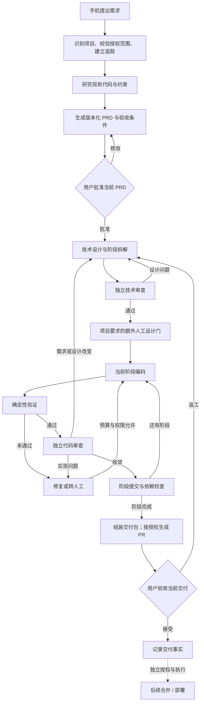

# 自动化开发流程与执行

> 本版包含截至 2026-09-22 的已合入实现。历史线上证据与本次公开快照验证分开记录，完整手机开发交付链路尚未在本轮验收。见[验证说明](../verification.md)。
[项目首页](../../README.md) · [文档目录](./README.md)

完整目标流程、角色分工、Worker、独立审查、阶段交付及执行配置。

> 实现清单更新于 2026-09-23。文中的 2026-09-17 部署与实测记录属于历史证据；本轮离线结果见验证说明。

本篇导航：[DAL：完整自动化开发链路](#workflow) · [Worker、执行前检查与隔离](#execution) · [独立审查、修复收敛与交付](#review) · [模型、角色与执行配置](#profiles)

## 1. DAL：完整自动化开发链路

### 1.1 为什么不是一个无限循环的 Coding Agent

DAL 将四个层次分开：

| 层次 | 管理什么 | 不能越过的边界 |
| --- | --- | --- |
| **Graph：整体流程** | 动作顺序、依赖、条件分支、人工门、暂停和恢复 | 下一阶段由控制面根据规则与证据决定 |
| **Loop：局部执行** | 某一步中的尝试、观察、验证和修复 | 局部循环不能越过预算、审批和阶段边界 |
| **Context：角色输入** | 当前任务、批准文档、固定版本、相关差异和验证证据 | 不默认继承作者的全部对话，也不把上下文当授权 |
| **Harness：执行约束** | 工具、工作区、网络、凭据、超时和验证器 | 不由被执行的模型自行宣布限制有效 |

这使系统能回答：现在进行到哪一步、谁获准执行、审批对应哪个版本、失败发生在哪里、下一步由谁决定。

### 1.2 从需求到交付的目标流程

> 本节完整说明已经确定的工作流方向和应满足的协议。相关组件的实现程度不同，**整条用户路径尚未完成端到端验收**；它不是现阶段可直接运行的使用说明。

图中返工进入技术设计只表示重新评估的入口：涉及产品范围变化时，必须进一步回到 PRD 及其审批，而不是在技术方案里悄悄扩大需求。

### 1.3 每一步的职责与产物

| 步骤 | 主要执行者 | 必须保留的产物或事实 | 推进条件 |
| --- | --- | --- | --- |
| 1. 需求进入 | iOS 与控制面 | 原始需求、任务标识、澄清状态 | 需求已持久化，重复提交可识别 |
| 2. 项目判断 | repo router 提建议；控制面裁定 | 已有项目或新项目建议、依据与歧义 | 目标处于用户登记的授权范围；不靠模型猜测取得权限 |
| 3. 追踪与工作区 | 控制面、GitHub adapter、Worker | 项目映射、固定 base、分支或本地项目、隔离目录 | 对象与权限完整绑定；新项目不必先有远端 |
| 4. 基础研究 | research 角色 | 仓库事实、相关实现、约束、未知项 | 事实有来源，未确定内容不伪装成结论 |
| 5. 编写 PRD | PRD author | 范围、非目标、验收、风险、待决策项 | 文档版本固定，可供用户审核 |
| 6. PRD 审批 | 用户与控制面 | 绑定当前文档和状态的决定 | 修改文档后重新审核，不沿用旧批准 |
| 7. 技术设计 | designer | 方案、阶段、依赖、测试和提交条件 | 不偏离批准范围；明确失败与恢复路径 |
| 8. 技术审查 | 独立 design reviewer | 审查意见、设计修订与处置 | 不让 reviewer 修改后自审；必要时经过项目人工门 |
| 9. 阶段编码 | coder | 当前阶段候选差异与实现说明 | 只在批准工作区和路径内执行 |
| 10. 验证与代码审查 | verifier、独立 code reviewer | 测试记录、固定版本的 findings | 检查完整性和审查独立性满足当前合同 |
| 11. 修复与阶段推进 | coder 与控制面 | 修复差异、重跑验证、复审结论、阶段提交 | 未解决问题和预算可判定；满足依赖后才进入下一阶段 |
| 12. 交付组装 | delivery 组件与 GitHub adapter | 变更摘要、PR 或本地交付、测试、风险、阶段记录 | 生成和执行远端写入意图分别满足授权与事实校验 |
| 13. 用户验收 | 用户与控制面 | 绑定当前产物的接受或修改决定 | 记录实际交付；不自动扩展成合并或部署授权 |

依据：完整开发流程规划（原仓库路径：`docs/dal/DAL_完整开发流程优先规划_v0.1.md`）、P0-02 审阅包（原仓库路径：`docs/dal/P0-02_统一审阅包_v0.1.md`）。

### 1.4 人工门不是固定的“两次点击”

通用产品流程的两道日常业务门是 **PRD 审批**和**交付验收**。但这不表示任意任务从需求到上线只需要两次人工操作。

Personal Agent 本仓库保留额外的技术方案人工审批要求；新增资源、真实 provider 调用、权限变化和生产操作也可能需要独立授权。继续到合并、部署时，还要遵守各自的审批和执行边界。

同样，“已经批准过这个能力方向”不能替代“批准了本轮改动范围”。每一轮新增功能或重要偏差都需要相应 PRD、技术方案及 gate 记录。

## 2. Worker、执行前检查与隔离

### 2.1 ECS 是控制面，Mac mini 是受限执行节点

Mac mini Worker 通过出站 HTTPS 连接 ECS 上的 DAL 服务领取任务，围绕已登记仓库与固定 base 准备工作区，运行指定角色和工具链，再向 ECS 提交检查点、产物及回执。队列和全局状态留在 ECS，本地 Supervisor／工作区记录不替代它们。

在设计分工中，Worker 可以在受控工作区创建本地候选变更和获准的提交，但不持有 DAL 的 GitHub 写入凭据，不直接 push、开 PR、合并或部署。自动远端写入由 ECS 控制面的 GitHub adapter 负责。

入口：[poll_once.py](../../src/personal_agent_dal/worker/poll_once.py)、[GitHub 模块](../../src/personal_agent_dal/github/)。

### 2.2 领取任务不等于马上启动模型

执行前还需核对有效任务所有权、当前授权、任务与策略租约、执行快照、Supervisor manifest 和本机准入条件。相关检查在模型或子进程启动前发生，不能只在输出回来后说“没有发现违规”。

本地工作区 reservation 不是服务端 lease；家庭机器上一条本地记录也不能替代全局授权。工作区、路径、符号链接、文件身份和进程归属均有独立约束。

实现入口：[supervisor.py](../../src/personal_agent_dal/worker/supervisor.py)、[action_lifecycle.py](../../src/personal_agent_dal/machine/action_lifecycle.py)。具体 launcher 的可用性仍受它自身的执行模式和准入状态限制。

### 2.3 两类租约不能混为一谈

**任务租约**回答“当前由哪个 Worker 负责这份 Job”；**策略租约**回答“执行这一动作的许可是否仍有效”。二者相关，但不是同一个对象。

派发和接纳结果时还要检查 owner、fence 与相关 epoch。旧 Worker 即使晚交了一份格式正确的结果，也不能越过已失效的所有权和批准继续推进任务。

启动配置变化、CLI 或身份环境变化，以及需要重新核验的机器状态变化，都不能简单当作 token 续期问题处理。

### 2.4 worktree 是工作区隔离，不是完整安全沙箱

分支和 worktree 用于隔离候选变更、固定审查对象、支持并行开发与恢复；它们本身不限制网络访问，也不阻止进程读取操作系统允许读取的其他文件。

执行安全还依赖进程权限、沙箱、凭据隔离、网络限制、固定工具链和准入检查。不能因为用了 worktree，就宣称任意不可信代码可以安全运行；也不能因为某个模型提供“只读模式”，就省略实际执行边界的验证。

## 3. 独立审查、修复收敛与交付

### 3.1 Coder 不能自证完成

实现者负责形成候选变更，确定性验证器负责运行约定检查，独立 reviewer 根据批准合同和固定差异检查问题，用户接受业务结果。

这四种职责互补，但不能替代：测试通过不证明需求被正确理解；模型审查通过不证明真实集成成功；用户认可某次展示也不自动证明所有故障路径均已覆盖。

Reviewer 接收的应是最小充分交接包：批准文档、验收条件、base 与候选版本、真实 diff、实际测试结果、已知未验证项，以及需要复核的 findings。默认不把实现过程中完整的自我解释与长对话作为唯一依据。

### 3.2 独立性需要可检查的绑定

当前 review/fix 合同不仅检查角色名称，还检查会话、上下文绑定和独立性标识。Reviewer 不应复用 coder 的上下文冒充独立审查；复审也不能简单继承上一轮“通过”。

审查者产生 findings，修复者修改代码，新的审查对固定候选和处置证据重新判断。改变模型名称并不能自动证明独立性，更不能证明结论没有遗漏。

源码：[review_independence.py](../../src/personal_agent_dal/machine/review_independence.py)、[review_fix_loop.py](../../src/personal_agent_dal/machine/review_fix_loop.py)。

### 3.3 修复循环必须有停止条件

当前冻结合同对自动 review → fix → verify 循环设置三轮完整修复周期上限。开启下一轮前先检查预算与验证前提；不能为了取得一个看起来更好看的结果而无界追加模型调用。

超过自动边界后交由人工处理或重新规划。需求、设计、实现和环境问题应分流处理，不是全部回到 coder“再修一次”。

已关闭 findings、仍开放的问题和新增问题需要分别记录，不能只保留 reviewer 最后一句“没有问题”。代码变化后，相关测试和审查证据必须重新绑定。

这些是已实现的审查合同与判定组件；自动多角色长链路的接线和实际收敛效果仍需要端到端验证。

### 3.4 交付有不同终点

| 终点 | 最少需要证明什么 |
| --- | --- |
| 单次执行结束 | 进程和调用结果可核对，产物已保存 |
| 阶段完成 | 当前阶段验收与验证通过，审查收敛，提交或检查点明确 |
| 可审核交付 | 产物、测试、审查、风险和未验证项齐全；PR 或本地交付可定位 |
| 用户接受交付 | 用户批准的是当前版本，不是旧候选 |
| 已合并 | GitHub 上准确目标的实际合并事实 |
| 已部署 | 对应发布版本的部署事实和所要求的验证 |

`report_only`、本地 commit、push、PR、merge 和 deploy 不是同义词。新项目可以先完成本地交付，不自动创建远端；接受交付也不自动授权合并或生产变更。

GitHub adapter 已有受控操作与恢复路径，后续重点是让业务阶段产生正确且获准的 intent，再推进已有链路，而不是把“有 adapter”写成“已经能自动交付所有任务”。

## 4. 模型、角色与执行配置

### 4.1 更换模型，不应重写业务工作流

项目把“做什么”“由谁推理”“使用什么工具运行”“在哪执行”“能做多少”分开考虑。

| 配置维度 | 内容 | 边界 |
| --- | --- | --- |
| Workflow profile | 动作、阶段、依赖、循环与人工门 | 普通模型配置不能删除必需审批 |
| Role binding | 研究、规划、设计、编码和审查角色的映射 | 角色不永久绑定某家模型 |
| Execution profile | Runtime adapter、provider、model、参数、预算、超时、允许的 fallback | 不支持的组合应拒绝；配置声明不等于真实可用 |
| Placement profile | Worker 能力、操作系统、工具链、仓库可达性 | 调度不能授予节点原本没有的权限和凭据 |
| Policy profile | 文件、工具、网络、审批、外部写入与审查独立性 | 权限覆盖不能突破硬边界 |

这是配置体系的设计分解。当前已有手动 A/B 配置、版本与固定执行快照等实现；**不宣称全部维度都已具备完整 UI、任意组合支持或自动调度能力。**

### 4.2 当前选择与切换语义

A/B 表示两套人工选择的执行方案，不是随机实验，也不是自动故障转移。未就绪的方案需要明确阻塞，不能从历史文档猜出一个模型配置来补齐。

每次动作应绑定当时有效的配置快照。修改默认配置，不应让进行中的调用中途悄悄换模型；需要换方案时，先到达可以证明的停止或交接点，保留候选版本、未完成问题、旧尝试状态和实际使用配置。

普通重试与“换配置再跑”必须区分。后者不能复用不再适用的 lease、capability 或审查结论，更不能借切换绕过 `unknown` 的结果核对。

密钥应通过受控 secret reference 和执行节点的凭据管理解析，不放入 PRD、执行快照、任务正文或日志。已有安全 classifier 等特殊配置仍受自身合同约束，不能把“可配置”解释成所有安全部件都可任意替换。

依据：完整开发流程规划（原仓库路径：`docs/dal/DAL_完整开发流程优先规划_v0.1.md`）、A/B 方案（原仓库路径：`docs/dal/开发链路_AB方案_v0.1.md`）。历史方案中的具体模型搭配只解释历史运行，不是本项目的长期推荐配置。
